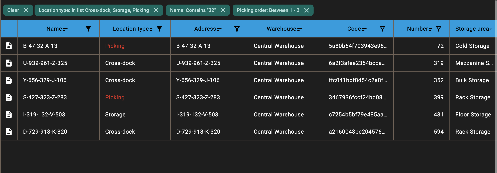

### Data Table for Compose Multiplatform (Material 3)

[](https://central.sonatype.com/artifact/ua.wwind.table-kmp/table-core)

Compose Multiplatform data table with Material 3 look & feel. Includes a core table (`table-core`), a conditional
formatting add‑on (`table-format`), and paging integration (`table-paging`).

### Table of Contents

- [Example](#example)
- [Modules](#modules)
- [Key features](#key-features)
- [Installation](#installation)
- [Compatibility](#compatibility)
- [Quick start](#quick-start)
- [Cell editing mode](#cell-editing-mode)
- [Data grouping](#data-grouping)
- [Footer row](#footer-row)
- [Paging integration (table-paging)](#paging-integration-table-paging)
- [Conditional formatting (table-format)](#conditional-formatting-table-format)
- [Core API reference (table-core)](#core-api-reference-table-core)
- [Filters (built‑in types)](#filters-builtin-types)
- [Fast Filters](#fast-filters)
- [Selection](#selection)
- [Dynamic row height and auto‑width](#dynamic-row-height-and-autowidth)
- [Drag-to-scroll](#drag-to-scroll)
- [Custom header icons](#custom-header-icons)
- [Supported targets](#supported-targets)
- [Third-Party Libraries](#third-party-libraries)
- [License](#license)

### Example

Here's what the data table looks like in action:


Live demo: [white-wind-llc.github.io/table](https://white-wind-llc.github.io/table/)

### Modules

- `table-core`: core table (rendering, header, sorting, column resize and reordering, filtering, row selection, i18n,
  styling/customization; dynamic or fixed row height).
- `table-format`: dialog and APIs for rule‑based conditional formatting for cells/rows.
- `table-paging`: adapter on top of the core table for `PagingData` (`ua.wwind.paging`).

### Key features

- Header with sort/filter icons (customizable via `TableHeaderDefaults.icons`).
- Per‑column sorting (3‑state: ASC → DESC → none).
- Data grouping by column with customizable group headers and sticky positioning.
- Footer row with customizable content per column (totals, averages, summaries); supports pinned and scrollable modes.
- Drag & drop to reorder columns in the header.
- Column resize via drag with per‑column min width.
- Filters: text, number (int/double, ranges), boolean, date, enum (single/multi; IN/NOT IN/EQUALS) with built‑in
  `FilterPanel`.
- Active filters header above the table (chips + “Clear all”).
- Row selection modes: None / Single / Multiple; optional striped rows.
- Embedded (nested) tables via the `embedded` flag and `rowEmbedded` slot for building master–detail layouts inside
  a single table.
- Extensive customization via `TableCustomization` (background/content color, elevation, borders, typography,
  alignment).
- i18n via `StringProvider` (default `DefaultStrings`).
- Targets: Android / JVM (Desktop) / JS (Web) / iOS (KMP source sets present; targets enabled via project conventions).
- Pinned columns with configurable side (left/right) and count.

### Installation

Add repository (usually `mavenCentral`) and include the modules you need:

```kotlin
dependencies {
    implementation("ua.wwind.table-kmp:table-core:1.6.4")
    // optional
    implementation("ua.wwind.table-kmp:table-format:1.6.4")
    implementation("ua.wwind.table-kmp:table-paging:1.6.4")
}
```

The project uses `kotlinx-collections-immutable` for all table/state collections to ensure predictable, thread-safe
state management and efficient Compose recomposition:

```kotlin
dependencies {
    implementation("org.jetbrains.kotlinx:kotlinx-collections-immutable:<latest-version>")
}
```

Opt‑in to experimental API on call sites that use the table:

```kotlin
@OptIn(ExperimentalTableApi::class)
@Composable
fun MyScreen() { /* ... */
}
```

### Compatibility

The following table lists compatibility information for released library versions.

| Version | Kotlin | Compose Multiplatform |
|---------|-------:|----------------------:|
| 1.4.0   | 2.2.21 |                 1.9.3 |
| 1.3.1   | 2.2.21 |                 1.9.2 |
| 1.2.1   | 2.2.10 |                 1.9.0 |

### Quick start

#### 1) Model and fields

```kotlin
data class Person(val name: String, val age: Int)

enum class PersonField { Name, Age }
```

#### 2) Columns (DSL `tableColumns`)

```kotlin
val columns = tableColumns<Person, PersonField, PersonTableData> {
    column(PersonField.Name, valueOf = { it.name }) {
        header("Name")
        cell { Text(it.name) }
        sortable()
        // Enable built‑in Text filter UI in header
        filter(TableFilterType.TextTableFilter())
        // Auto‑fit to content with optional max cap
        autoWidth(max = 500.dp)

        // Optional footer with access to table data
        footer { tableData ->
            Text("Total: ${tableData.displayedPeople.size}")
        }
    }

    column(PersonField.Age, valueOf = { it.age }) {
        header("Age")
        cell { Text(it.age.toString()) }
        sortable()
        align(Alignment.End)
        filter(
            TableFilterType.NumberTableFilter(
                delegate = TableFilterType.NumberTableFilter.IntDelegate,
                rangeOptions = 0 to 120
            )
        )
    }
}
```

Column options: `sortable`, `resizable`, `visible`, `width(min, pref)`, `autoWidth(max)`, `align(...)`,
`rowHeight(min, max)`, `filter(...)`, `groupHeader(...)`, `headerDecorations(...)`, `headerClickToSort(...)`,
`footer(...)`.

#### 3) Table state

```kotlin
val state = rememberTableState(
    columns = columns.map { it.key },
    settings = TableSettings(
        stripedRows = true,
        showActiveFiltersHeader = true,
        selectionMode = SelectionMode.Single,
    )
)
```

You can also provide `initialOrder`, `initialWidths`, `initialSort` and update from outside using
`state.setColumnOrder(...)`, `state.setColumnWidths(...)`.

#### 4) Rendering (core)

```kotlin
@Composable
fun PeopleTable(items: List<Person>) {
    Table(
        itemsCount = items.size,
        itemAt = { index -> items.getOrNull(index) },
        state = state,
        columns = columns,
        onRowClick = { person -> /* ... */ },
    )
}
```

Useful parameters: `placeholderRow`, `contextMenu` (long‑press/right‑click),
`colors = TableDefaults.colors()`, `icons = TableHeaderDefaults.icons()`.

### Cell editing mode

The table supports row‑scoped cell editing with custom edit UI, validation and keyboard navigation.

- **Table‑level switch**: enable editing via `TableSettings(editingEnabled = true)`.
- **Editable table**: use `EditableTable<T, C, E>` when you need editing support.
- **Table data parameter**: the generic parameter `E` represents table data (shared state) accessible in headers,
  footers, and edit cells. This allows passing validation errors, aggregated values, or any other table-wide state.
- **Editable columns DSL**: declare columns with `editableTableColumns<T, C, E> { ... }` and per‑cell `editCell`.
- **Callbacks**: validate and react to edit lifecycle with `onRowEditStart`, `onRowEditComplete`, `onEditCancelled`.
- **Keyboard**: Enter/Done moves to the next editable cell; Escape cancels editing (desktop targets).

#### TableCellTextField: text field adapted for table editing

For text editing inside table cells there is a dedicated composable `TableCellTextField`:

- **Focus integration**: it is already wired to the table focus system via `syncEditCellFocus()` on its `Modifier`.
  This ensures that when a row enters edit mode, the correct cell receives focus, and that keyboard navigation
  (Enter/Done to move to the next editable cell, Escape to cancel) works consistently across targets.
- **Compact layout**: by default it uses reduced paddings and no border to better fit into dense table rows.
- **Visual consistency**: styles and colors match Material 3 inputs used in the rest of the table UI.

Whenever you build text‑based edit UI for a cell, prefer `TableCellTextField` over a raw `TextField`/
`BasicTextField`. This way you get correct focus behavior and table‑aware UX without any additional setup.

Minimal example with `TableCellTextField`:

```kotlin
data class Person(val id: Int, val name: String, val age: Int)

// Table data containing displayed items and edit state
data class PersonTableData(
    val displayedPeople: List<Person> = emptyList(),
    val editState: PersonEditState = PersonEditState(),
)

// Per‑row edit state (validation, errors, etc.)
data class PersonEditState(
    val person: Person? = null,
    val nameError: String = "",
    val ageError: String = "",
)

enum class PersonColumn { NAME, AGE }

val settings = TableSettings(
    editingEnabled = true,
    rowHeightMode = RowHeightMode.Dynamic,
)

val state = rememberTableState(
    columns = PersonColumn.entries.toImmutableList(),
    settings = settings,
)

// Editable columns definition
val columns = editableTableColumns<Person, PersonColumn, PersonTableData> {
    column(PersonColumn.NAME, valueOf = { it.name }) {
        title { "Name" }
        cell { person -> Text(person.name) }

        // Edit UI for the cell; table decides when to show it
        editCell { person, tableData, onComplete ->
            var text by remember(person) { mutableStateOf(person.name) }

            TableCellTextField(
                value = text,
                onValueChange = { text = it },
                isError = tableData.editState.nameError.isNotEmpty(),
                keyboardOptions = KeyboardOptions(imeAction = ImeAction.Done),
                keyboardActions = KeyboardActions(onDone = { onComplete() }),
            )
        }

        // Footer with access to table data
        footer { tableData ->
            Text("Total: ${tableData.displayedPeople.size}")
        }
    }

    column(PersonColumn.AGE, valueOf = { it.age }) {
        title { "Age" }
        cell { person -> Text(person.age.toString()) }

        editCell { person, tableData, onComplete ->
            var text by remember(person) { mutableStateOf(person.age.toString()) }

            TableCellTextField(
                value = text,
                onValueChange = { input ->
                    text = input.filter { it.isDigit() }
                },
                keyboardOptions = KeyboardOptions(
                    keyboardType = KeyboardType.Number,
                    imeAction = ImeAction.Done,
                ),
                keyboardActions = KeyboardActions(onDone = { onComplete() }),
            )
        }
    }
}

// Somewhere in your screen
EditableTable(
    itemsCount = people.size,
    itemAt = { index -> people.getOrNull(index) },
    state = state,
    columns = columns,
    tableData = currentTableData, // your PersonTableData instance
    onRowEditStart = { person, rowIndex ->
        // Initialize edit state for the row
    },
    onRowEditComplete = { rowIndex ->
        // Validate and persist; return true to exit edit mode, false to keep editing
        true
    },
    onEditCancelled = { rowIndex ->
        // Optional: revert in‑memory changes
    },
)
```

#### Focus handling for custom edit implementations

If you build custom edit content that includes its own text field implementation or composite inputs, you should
integrate with the table focus handling. There are two options:

- **Use `TableCellTextField` directly**: this is the recommended and simplest way. It already calls
  `syncEditCellFocus()` on its `modifier`, so the cell participates in the table focus chain automatically.
- **Reuse the focus modifier in custom components**: if you must write your own text field wrapper, make sure to
  apply the same modifier:

```kotlin
@Composable
fun CustomCellEditor(
    value: String,
    onValueChange: (String) -> Unit,
) {
    BasicTextField(
        value = value,
        onValueChange = onValueChange,
        modifier = Modifier
            .fillMaxWidth()
            .syncEditCellFocus(),
    )
}
```

The `syncEditCellFocus()` modifier performs the following table‑specific work:

- **Tracks the active edit cell** and requests focus when its row/column become active.
- **Releases focus and clears selection** when editing ends or moves to another cell.
- **Coordinates keyboard navigation** so that `onComplete` in `editCell` moves to the next editable cell and
  eventually triggers `onRowEditComplete`.

By either using `TableCellTextField` or reusing `syncEditCellFocus()` in your own composables, custom edit UIs stay
consistent with the default table editing behavior.

Runtime behavior:
- Double‑click on an editable cell to enter **row edit mode**.
- All editable cells in the row render their `editCell` content.
- Press **Enter/Done** in a cell to call `onComplete()` and move to the next editable column.
- After the last editable cell, `onRowEditComplete` is invoked; returning `false` keeps the row in edit mode.
- Press **Escape** to cancel editing and trigger `onEditCancelled` (desktop targets).

### Data grouping

Group table data by any column to organize and visualize hierarchical relationships:

```kotlin
// Enable grouping programmatically
state.groupBy = PersonField.Department

// Or let users group via header dropdown menu
// (automatically available for all columns)
```

Customize group header appearance and content:

```kotlin
column(PersonField.Department, valueOf = { it.department }) {
    header("Department")
    cell { Text(it.department) }

    // Custom group header renderer
    groupHeader { groupValue ->
        Row(
            verticalAlignment = Alignment.CenterVertically,
            modifier = Modifier.padding(8.dp)
        ) {
            Icon(Icons.Default.Group, contentDescription = null)
            Spacer(modifier = Modifier.width(8.dp))
            Text(
                text = "Department: $groupValue",
                style = MaterialTheme.typography.titleMedium,
                fontWeight = FontWeight.Bold
            )
        }
    }
}
```

Group headers are sticky and remain visible during scrolling. Configure group content alignment via table settings:

```kotlin
val state = rememberTableState(
    columns = columns.map { it.key },
    settings = TableSettings(
        groupContentAlignment = Alignment.CenterStart,
        // ... other settings
    )
)
```

### Footer row

Display a summary footer row at the bottom of the table with custom content per column. Footer receives table data as a
parameter, allowing access to displayed items and other table state:

```kotlin
data class PersonTableData(
    val displayedPeople: List<Person>,
    val editState: PersonEditState,
)

val columns = tableColumns<Person, PersonField, PersonTableData> {
    column(PersonField.Name, valueOf = { it.name }) {
        header("Name")
        cell { Text(it.name) }

        // Footer content with access to table data (Unit for non-editable tables)
        footer { tableData ->
            Text(
                text = "Total: ${tableData.displayedPeople.size}",
                fontWeight = FontWeight.Bold
            )
        }
    }
}
```

Configure footer behavior via table settings:

```kotlin
val state = rememberTableState(
    columns = columns.map { it.key },
    settings = TableSettings(
        showFooter = true,      // Enable footer display
        footerPinned = true,    // Pin footer at bottom (default)
        // ... other settings
    )
)
```

Footer options:

- **showFooter**: Enable or disable footer row display.
- **footerPinned**: When `true` (default), footer stays visible at the bottom of the table viewport, similar to a sticky
  header. When `false`, footer scrolls with table content.
- **footerHeight**: Customize footer height via `TableDimensions.footerHeight`.
- **footerColors**: Customize footer colors via `TableColors.footerContainerColor` and `TableColors.footerContentColor`.

The footer:

- Respects column widths and alignment settings from the main table.
- Supports pinned columns just like header and body rows.
- Synchronizes horizontal scrolling with the rest of the table.
- For embedded tables, footer is always non-pinned and scrolls with content.

### Paging integration (`table-paging`)

```kotlin
@Composable
fun PeoplePagingTable(paging: PagingData<Person>) {
    Table(
        items = paging,
        state = state,
        columns = columns,
    )
}
```

There is also `LazyListScope.handleLoadState(...)` to render loading/empty states.

### Conditional formatting (`table-format`)

- Build a `TableCustomization` from rules via `rememberCustomization(rules, matches = ...)`. Row‑wide rules have
  `columns = emptyList()`; cell‑specific rules list field keys in `columns`.
- Use `FormatDialog(...)` to create/edit rules (Design / Condition / Fields tabs).

```kotlin
// 1) Rules
val rules = remember {
    listOf(
        TableFormatRule.new<PersonField, Person>(id = 1, filter = Person("", 0))
    )
}

// 2) Matching logic
val customization = rememberCustomization<Person, PersonField, Person>(
    rules = rules,
    matches = { item, filter -> item.age >= 65 },
)

// 3) Pass customization to the table
Table(
    itemsCount = items.size,
    itemAt = { index -> items.getOrNull(index) },
    state = state,
    columns = columns,
    customization = customization,
)

// 4) Optional: rules editor dialog
FormatDialog(
    showDialog = show,
    rules = rules,
    onRulesChanged = { /* persist */ },
    getNewRule = { id -> TableFormatRule.new<PersonField, Person>(id, Person("", 0)) },
    getTitle = { field -> field.name },
    filters = { rule, onApply -> /* return list of FormatFilterData for fields */ emptyList() },
    entries = PersonField.entries,
    key = Unit,
    strings = DefaultStrings,
    onDismissRequest = { /* ... */ },
)
```

`rememberCustomization` merges base styles with matching rules into a resulting `TableCustomization` (background,
content color, text style, alignment, etc.).

### Core API reference (table-core)

- **Composable `Table<T, C>`**: renders header and virtualized rows for read-only tables (tableData = Unit).
    - **Required**: `itemsCount`, `itemAt(index)`, `state: TableState<C>`, `columns: List<ColumnSpec<T, C, Unit>>`.
    - **Slots**: `placeholderRow()`.
    - **UX**: `onRowClick`, `onRowLongClick`, `contextMenu(item, pos, dismiss)`.
    - **Look**: `customization`, `colors = TableDefaults.colors()`, `icons = TableHeaderDefaults.icons()`, `strings`.
    - **Scroll**: optional `verticalState`, `horizontalState`.
    - **Embedded content**: `embedded` flag and `rowEmbedded` slot let you render nested detail content or even a
      secondary table inside each row, while still reusing the same table state, filters and formatting rules.
- **Composable `Table<T, C, E>`**: overload that accepts custom table data for headers, footers, and edit cells.
    - **Additional parameter**: `tableData: E` - shared state accessible in headers, footers, custom filters, and edit
      cells.
    - All other parameters same as read-only variant.
- **Composable `EditableTable<T, C, E>`**: renders header and virtualized rows with editing support.
    - **Additional parameters**: `tableData: E`, `onRowEditStart`, `onRowEditComplete`, `onEditCancelled`.
    - Columns must use `ColumnSpec<T, C, E>` with `E` matching the tableData type.
- **Columns DSL**:
    - `tableColumns<T, C, E> { ... }` produces `List<ColumnSpec<T, C, E>>` for read-only tables.
    - `editableTableColumns<T, C, E> { ... }` produces `List<ColumnSpec<T, C, E>>` for editable tables.
    - Column configuration:
        - Header: `header("Text")` or `header(tableData) { ... }`; optional `title { "Name" }` for active filter chips.
        - Footer: `footer(tableData) { ... }` for custom footer cell content with access to table data.
        - Editing: `editCell { item, tableData, onComplete -> ... }` for custom edit UI.
        - Sorting: `sortable()`, `headerClickToSort(Boolean)`.
        - Filters UI: `filter(TableFilterType.*)`.
        - Sizing: `width(min, pref)`, `autoWidth(max)`, `resizable(Boolean)`, `align(Alignment.Horizontal)`.
        - Row height hints: `rowHeight(min, max)` used when `rowHeightMode = Dynamic`.
          - Decorations: `headerDecorations(Boolean)` to hide built‑ins when fully customizing header.
- **Header customization**
    - When `headerDecorations = true` (default), the table places sort and filter icons automatically.
    - For a fully custom header, set `headerDecorations(false)` and use helpers inside `header { ... }`:

```kotlin
column(PersonField.Name, valueOf = { it.name }) {
    headerDecorations(false)
    header {
        Row(verticalAlignment = Alignment.CenterVertically) {
            Text("Name", modifier = Modifier.padding(end = 8.dp))
            TableHeaderSortIcon()
            TableHeaderFilterIcon()
        }
    }
    sortable()
    filter(TableFilterType.TextTableFilter())
}
```

- **State**: `rememberTableState(columns, initialSort?, initialOrder?, initialWidths?, settings?, dimensions?)`.
    - Sorting: `state.setSort(column, order?)`; current `state.sort`.
    - Grouping: `state.groupBy(column)` to enable grouping; `state.groupBy(null)` to disable.
    - Column order/size: `state.setColumnOrder(order)`, `state.resizeColumn(column, Set/Reset)`,
      `state.setColumnWidths(map)`.
    - Auto-width recalculation: `state.recalculateAutoWidths()` to manually recompute column
      widths based on current content measurements. Useful for deferred/paginated data loading where initial auto-width
      calculation happened on empty data.
    - Filters: `state.setFilter(column, TableFilterState(...))`; current per‑column `state.filters`.
    - Selection: `state.toggleSelect(index)`, `state.toggleCheck(index)`, `state.toggleCheckAll(count)`,
      `state.selectCell(row, column)`.
- **Settings and geometry**
    - `TableSettings`: `isDragEnabled`, `autoApplyFilters`, `autoFilterDebounce`, `stripedRows`,
      `showActiveFiltersHeader`, `selectionMode: None/Single/Multiple`, `groupContentAlignment`,
      `rowHeightMode: Fixed/Dynamic`, `enableDragToScroll` (controls whether drag-to-scroll is enabled; when disabled,
      traditional scrollbars are used instead), `editingEnabled` (master switch for cell editing mode), `showFooter`
      (enable footer row display), `footerPinned` (pin footer at bottom or scroll with content).
    - `TableDimensions`: `defaultColumnWidth`, `defaultRowHeight`, `footerHeight`, `checkBoxColumnWidth`,
      `verticalDividerThickness`, `verticalDividerPaddingHorizontal`.
    - `TableColors`: via `TableDefaults.colors(...)`.

### Filters (built‑in types)

- **TextTableFilter**: contains/starts/ends/equals.
- **NumberTableFilter(Int/Double)**: gt/gte/lt/lte/equals/not_equals/between + optional range slider via `rangeOptions`.
- **BooleanTableFilter**: equals; optional `getTitle(BooleanType)`.
- **DateTableFilter**: gt/gte/lt/lte/equals/between (uses `kotlinx.datetime.LocalDate`).
- **EnumTableFilter<T: Enum<T>>**: in/not_in/equals with `options: List<T>` and `getTitle(T)`.
- **CustomTableFilter<T, E>**: fully custom filter UI and state with access to table data. Implement
  `CustomFilterRenderer<T, E>` for main panel and
  optional fast filter (both receive `tableData: E` parameter), and `CustomFilterStateProvider<T>` for chip text.
  Supports data visualizations of any complexity, including dynamic histograms and statistics based on current table
  data.
- **DisabledTableFilter**: special marker filter type that completely disables filtering for a column while keeping
  the API contract (no filter UI is rendered for such columns in filter panels and conditional formatting dialogs).

Applying filters to data is app‑specific. Example:

```kotlin
val filtered = remember(items, state.filters) {
    items.filter { item ->
        // Evaluate your domain against active state.filters
        // See `table-sample` for a full example
        true
    }
}
```

### Fast Filters

Fast filters provide quick inline filtering directly in a dedicated row below the header. They share the same
`TableFilterState` as main filters but with simplified UI and pre-set default constraints:

- **Location**: Rendered as a horizontal row below the header when `settings.showFastFilters = true`.
- **Synchronized state**: Fast filters and main filter panels use the same `state.filters`, changes in one immediately
  reflect in the other.
- **Default constraints**: Each fast filter type uses a sensible default:
    - `TextTableFilter` → CONTAINS
    - `NumberTableFilter` → EQUALS
    - `BooleanTableFilter` → EQUALS (tri-state checkbox)
    - `DateTableFilter` → EQUALS (date picker)
    - `EnumTableFilter` → EQUALS (dropdown)
    - `CustomTableFilter` → fully custom (implement `RenderFastFilter` or leave empty)
- **Auto-apply**: Fast filters always apply changes automatically with debounce (controlled by
  `settings.autoFilterDebounce`).

Fast filters are ideal for quick data exploration and filtering without opening the full filter panel dialog.

### Selection

- `SelectionMode.None` (default), `Single`, `Multiple`.
- In Multiple mode, you can handle selection programmatically:

```kotlin
Table(
    itemsCount = items.size,
    itemAt = { index -> items[index] },
    state = state,
    columns = columns,
    onRowClick = { _ -> state.toggleCheck(/* row index comes from key or context */) }
)
```

### Dynamic row height and auto‑width

- Dynamic height: set `rowHeightMode = RowHeightMode.Dynamic`. Use per‑column `rowHeight(min, max)` to hint bounds.
- Auto‑width: call `autoWidth(max?)` in column builder. The table measures header + first batch of rows and applies
  widths once per phase. Double‑click the header resizer to snap a column to its measured max content width.
- Alternatively, use `state.recalculateAutoWidths()` to manually trigger width recalculation based on
  current content measurements (useful for deferred/paginated data loading scenarios).

### Drag-to-scroll

By default, the table enables drag-to-scroll functionality, allowing users to pan the table content by dragging with
mouse or touch gestures. While this works well on mobile devices, it may not be ideal for desktop environments where
traditional scrollbars and mouse wheel navigation are preferred.

To disable drag-to-scroll and use standard scrollbars instead:

```kotlin
val state = rememberTableState(
    columns = columns.map { it.key },
    settings = TableSettings(
        enableDragToScroll = false, // Disable drag-to-scroll
        // ... other settings
    )
)
```

When `enableDragToScroll = false`:

- Mouse dragging will not scroll the table
- Horizontal and vertical scrollbars will be available
- Mouse wheel and trackpad gestures will work normally
- Better compatibility with cell selection and text selection workflows

### Custom header icons

Customize sort/filter icons:

```kotlin
val icons = TableHeaderDefaults.icons(
    sortAsc = MyUp,
    sortDesc = MyDown,
    sortNeutral = MySort,
    filterActive = MyFilterFilled,
    filterInactive = MyFilterOutline
)

Table(
    itemsCount = items.size,
    itemAt = { index -> items[index] },
    state = state,
    columns = columns,
    icons = icons
)
```

### Conditional formatting (table-format)

- Build `TableCustomization` from rules using `rememberCustomization(rules, matches = ...)`. Row‑wide rules have
  `columns = emptyList()`; cell‑specific rules list field keys in `columns`.
- Use `FormatDialog(...)` to let users create/edit rules.

Minimal example:

```kotlin
data class Person(val name: String, val age: Int, val rating: Int)
enum class PersonField { Name, Age, Rating }

// Rules
val rules = remember {
    val ratingFilter: Map<PersonField, TableFilterState<*>> =
        mapOf(
            PersonField.Rating to TableFilterState(
                constraint = FilterConstraint.GTE,
                values = listOf(4),
            ),
        )
    val ratingRule =
        TableFormatRule<PersonField, Map<PersonField, TableFilterState<*>>>(
            id = 1L,
            enabled = true,
            base = false,
            columns = listOf(PersonField.Rating),
            cellStyle = TableCellStyleConfig(
                contentColor = 0xFFFFD700.toInt(), // Gold
            ),
            filter = ratingFilter,
        )
    listOf(ratingRule)
}

// Matching logic (app‑specific)
val customization = rememberCustomization<Person, PersonField, Person>(
    rules = rules,
    matches = { person, ruleFilters ->
        for ((column, stateAny) in ruleFilters) {
            when (column) {
                PersonField.Rating -> {
                    val value = person.rating
                    val st = stateAny as TableFilterState<Int>
                    val constraint = st.constraint ?: continue
                    when (constraint) {
                        FilterConstraint.GT -> value > (st.values?.getOrNull(0) ?: value)
                        FilterConstraint.GTE -> value >= (st.values?.getOrNull(0) ?: value)
                        FilterConstraint.LT -> value < (st.values?.getOrNull(0) ?: value)
                        FilterConstraint.LTE -> value <= (st.values?.getOrNull(0) ?: value)
                        FilterConstraint.EQUALS -> value == (st.values?.getOrNull(0) ?: value)
                        FilterConstraint.NOT_EQUALS -> value != (st.values?.getOrNull(0) ?: value)
                        FilterConstraint.BETWEEN -> {
                            val from = st.values?.getOrNull(0) ?: value
                            val to = st.values?.getOrNull(1) ?: value
                            from <= value && value <= to
                        }

                        else -> true
                    }
                }
                else -> true
            }
        }
    }
)

Table(
    itemsCount = items.size,
    itemAt = { index -> items[index] },
    state = state,
    columns = columns,
    customization = customization
)

// Optional dialog
FormatDialog(
    showDialog = show,
    rules = rules,
    onRulesChanged = { /* persist */ },
    getNewRule = { id -> TableFormatRule.new<PersonField, Person>(id, Person("", 0)) },
    getTitle = { it.name },
    filters = { rule, onApply -> emptyList() }, // build `FormatFilterData` list for your fields
    entries = PersonField.values().toList(),
    key = Unit,
    strings = DefaultStrings,
    onDismissRequest = { show = false }
)
```

Public API highlights:

- `rememberCustomization<T, C, FILTER>(rules, matches = ...) : TableCustomization<T, C>`.
- `TableFormatRule<FIELD, FILTER>` with `columns: List<FIELD>`, `cellStyle: TableCellStyleConfig`, `filter: FILTER`.
- `FormatDialog(...)` and `FormatDialogSettings` for UX tweaks.
- `FormatFilterData<E>` to describe per‑field filter controls in the dialog.

### Supported targets

- Android, JVM (Desktop), JS (Web), iOS (KMP source sets present; targets enabled via project conventions).

### Star History

[](https://www.star-history.com/#White-Wind-LLC/table&type=date&legend=top-left)

### Third-Party Libraries

This project uses the following open source libraries:

| Library                                                                                  | License            | Description                                                    |
|------------------------------------------------------------------------------------------|--------------------|----------------------------------------------------------------|
| [Reorderable](https://github.com/Calvin-LL/Reorderable)                                  | Apache License 2.0 | Drag and drop functionality for reordering items in Compose    |
| [Paging for KMP](https://github.com/White-Wind-LLC/paging-kmp)                           | Apache License 2.0 | Kotlin Multiplatform paging library                            |
| [ColorPicker Compose](https://github.com/skydoves/colorpicker-compose)                   | Apache License 2.0 | Color picker component for Jetpack Compose                     |
| [Kermit](https://github.com/touchlab/Kermit)                                             | Apache License 2.0 | Kotlin Multiplatform logging library                           |

All third-party libraries are used in compliance with their respective licenses. For detailed license information, see
the individual library repositories linked above.

### License

Licensed under the Apache License, Version 2.0. See [LICENSE](LICENSE) for details.
