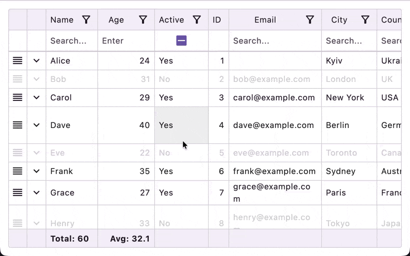

# Row reordering with Reorderable

The library provides a dedicated row reordering flow powered
by [Reorderable](https://github.com/Calvin-LL/Reorderable).



- **Enable it**: set `TableSettings(rowReorderEnabled = true)`.
- **Handle moves**: pass `onRowMove = { fromIndex, toIndex -> ... }` to `Table` or `EditableTable`.
- **How context is passed**: the `cell { ... }` DSL is backed by `context(TableCellScope)`, so inside a cell you can
  call `Modifier.draggableHandle()` or `Modifier.longPressDraggableHandle()` directly.
- **Interaction rules**: while row reorder mode is active, sorting and grouping interactions are disabled:
  `initialSort` is ignored and `state.setSort()` is a warning no-op. Under an active sort the rendered order is a
  function of row values, so a reorder would change nothing on screen — the two features cannot both apply.
- **Embedded support**: the same API works for embedded table bodies too.
- **Dragging several rows at once**: see [Row blocks](row-blocks.md). Once `rowBlocks` is declared it
  supersedes `onRowMove` — every gesture, standalone rows included, reports through
  `RowBlocks.onCommit` and `onRowMove` is never invoked.

Example:

```kotlin
data class Person(val id: Int, val name: String)

enum class PersonColumn { Handle, Name }

@Composable
fun ReorderablePeopleTable() {
    val people = remember {
        mutableStateListOf(
            Person(1, "Alice"),
            Person(2, "Bob"),
            Person(3, "Charlie"),
        )
    }

    val columns =
        remember {
            tableColumns<Person, PersonColumn, Unit> {
                column(PersonColumn.Handle, valueOf = { it.id }) {
                    width(48.dp, 48.dp)
                    resizable(false)
                    cell { _, _ ->
                        Box(
                            contentAlignment = Alignment.Center,
                            modifier = Modifier.fillMaxSize(),
                        ) {
                            Icon(
                                imageVector = Icons.Default.Reorder,
                                contentDescription = "Drag row",
                                modifier = Modifier.draggableHandle(),
                            )
                        }
                    }
                }

                column(PersonColumn.Name, valueOf = { it.name }) {
                    header("Name")
                    cell { person, _ -> Text(person.name) }
                }
            }
        }

    // Required in the consuming module:
    // compilerOptions { freeCompilerArgs.add("-Xcontext-parameters") }
    //
    // `cell { ... }` receives `context(TableCellScope)`, which is why
    // `Modifier.draggableHandle()` is available directly inside the cell lambda.
    val state =
        rememberTableState(
            columns = PersonColumn.entries.toImmutableList(),
            settings = TableSettings(rowReorderEnabled = true),
        )

    Table(
        itemsCount = people.size,
        itemAt = { index -> people.getOrNull(index) },
        state = state,
        columns = columns,
        onRowMove = { fromIndex, toIndex ->
            if (fromIndex !in people.indices || people.isEmpty()) return@Table

            val targetIndex = toIndex.coerceIn(0, people.lastIndex)
            if (fromIndex == targetIndex) return@Table

            val movedItem = people.removeAt(fromIndex)
            people.add(targetIndex, movedItem)
        },
    )
}
```

## Related

- [Row blocks](row-blocks.md) — adjacent rows that render and drag as one unit, with a header band,
  within-block reorder, and key-based commit events.
