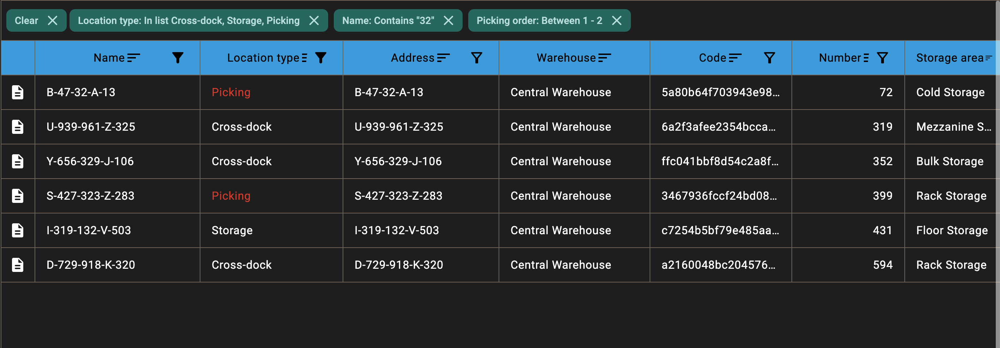

# WWind Data Table

Data Table for Compose Multiplatform (Material 3).

- **[Get started](getting-started/installation.md)** — add the dependency and render your first table.
- **[Guides](guides/index.md)** — editing, grouping, row blocks, filtering, selection, reordering and more.
- **[API Reference](api/)** — full KDoc-generated API.
- **[Live Demo](demo/)** — interactive WASM sample.
